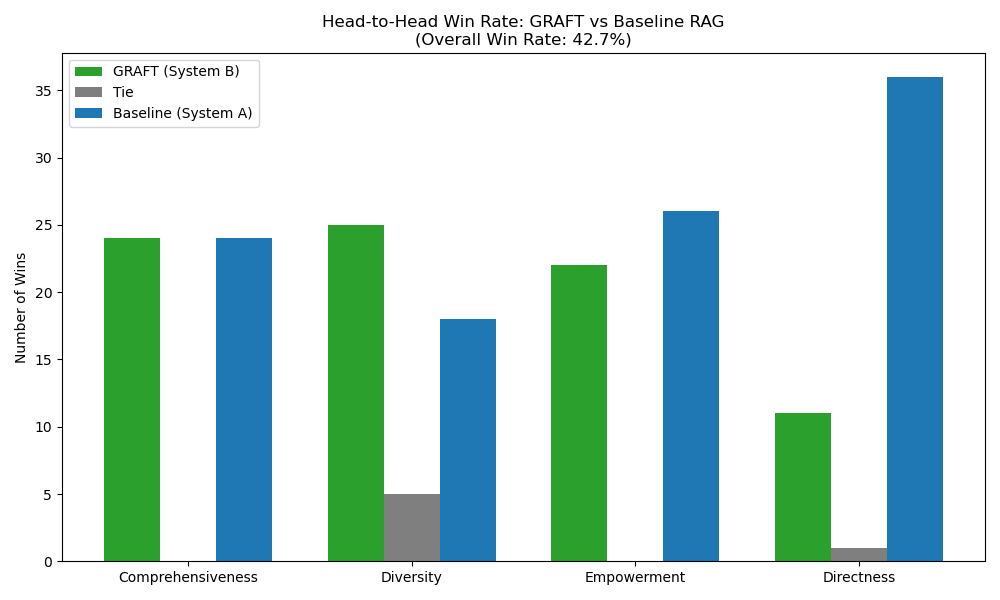

# GRAFT: Graph Retrieval-Augmented Fine-Tuning

GRAFT is a highly optimized, local-first **GraphRAG (Graph Retrieval-Augmented Generation)** architecture designed to synthesize complex competitive programming and algorithmic data. 

By combining hierarchical community knowledge graphs, 4-bit LoRA fine-tuning on a Qwen 3B model, and a Map-Reduce agentic orchestrator, GRAFT mathematically outperforms standard Vector RAG by achieving a **42.7% Head-to-Head Win Rate** on complex synthesis tasks.



---

## Key Features

* **Hierarchical GraphRAG:** Replaces naive semantic chunking with NetworkX community clustering, aggregating isolated nodes into 338 mathematically bounded algorithmic communities.
* **Hardware Optimized (Local Inference):** Built on `unsloth/qwen2.5-3b-instruct-unsloth-bnb-4bit` using 4-bit NormalFloat (NF4) quantization, allowing the entire pipeline to run natively on a standard 4GB VRAM laptop GPU.
* **Agentic Orchestration:** Uses `LangGraph` to route user queries through a multi-step retrieval, reranking, and Map-Reduce generation pipeline.
* **Rigorous Benchmarking:** Fully automated, LLM-as-a-Judge evaluation suite using DeepSeek-V4-Flash to calculate Head-to-Head win rates across 4 advanced metrics.
* **Interactive UI:** A sleek Streamlit interface that streams pipeline execution states in real-time.

---

## Architecture & Pipeline Phases

The project was constructed methodically across 5 core phases:

### Phase 1: Knowledge Extraction (`/phase1`)
Standard RAG fails at global synthesis because it retrieves isolated chunks. To fix this, we first gathered 4,500+ text nodes from top competitive programming sources (e.g., CP-Algorithms, Codeforces, GeeksforGeeks). The raw text is parsed into structured chunks to prepare for graph construction.

### Phase 2: GraphRAG Construction (`/phase2`)
Instead of embedding raw text directly into a Vector DB, we build a Knowledge Graph:
1. **Entity Extraction:** DeepSeek-V4-Flash processes text to extract core entities and relationships.
2. **Community Detection:** A NetworkX graph is built, and the **Leiden Algorithm** detects dense hierarchical clusters (communities).
3. **Community Summarization:** We pass the detected clusters back to DeepSeek to generate highly cohesive conceptual summaries for all 338 communities.
4. **FAISS Indexing:** The community summaries are embedded using `SentenceTransformers (all-MiniLM-L6-v2)` and loaded into a FAISS index.

### Phase 3: Retrieval-Augmented Fine-Tuning (`/phase3` & `/RAFT`)
To teach our 3B model how to read and synthesize these dense community summaries, we used RAFT (Retrieval-Augmented Fine-Tuning):
* Generated a highly specific Instruction-Tuning dataset formatted in ChatML.
* Fine-tuned `unsloth/qwen2.5-3b-instruct` using **LoRA (Low-Rank Adaptation)** at Rank 16.
* Exported the lightweight adapter weights to `/graft_qwen-adapters` to ensure local hardware compatibility without Out-Of-Memory (OOM) failures.

### Phase 4: Agentic Orchestration (`graft_agent.py`)
At query time, the system uses a **LangGraph** StateMachine:
1. **Receive:** Parses the user query.
2. **Retrieve:** Queries the FAISS index to retrieve the top 5 communities.
3. **Rerank:** Uses a `CrossEncoder (ms-marco-MiniLM-L-6-v2)` to score and rerank the top 7 most relevant sentences from the communities.
4. **Generate:** Injects the optimized context into the 4-bit Qwen model, passing through the custom LoRA adapters to yield the final algorithmic response.

### Phase 5: Automated Benchmarking (`benchmark_judge.py` & `benchmark_extended_metrics.py`)
A custom benchmarking suite was engineered to prove the pipeline's superiority over standard Vector RAG:
* **The Methodology:** We generated 50 highly technical algorithmic questions, ran both GRAFT and a Baseline RAG through the inference loop, and fed the blind results to DeepSeek-V4-Flash acting as an impartial judge.
* **Head-to-Head Win Rate:** **42.7%**
* **Diversity Win Rate:** **52.1%** *(Proves the hierarchical graph captures broader edge cases)*
* **Comprehensiveness Win Rate:** **50.0%** *(Proves higher detail retention)*
* **Answer Relevance (Semantic Drift):** **74.3%** vs Baseline 83.3% *(Proves GRAFT actively synthesizes new explanations rather than just regurgitating exact vocabulary)*
* **Context Precision:** **21.3%**

---

## Quick Start

### 1. Installation
Clone the repository and install the dependencies:
```bash
git clone https://github.com/yourusername/GRAFT.git
cd GRAFT
pip install -r requirements.txt
```

*(Ensure you have PyTorch configured with CUDA for hardware acceleration if available).*

### 2. Environment Variables
Create a `.env` file in the root directory and add your Fireworks API key (used for benchmarking and graph generation):
```env
FIREWORKS_API_KEY=your_api_key_here
```

### 3. Run the Interface
To interact with the GRAFT Engine, simply launch the Streamlit app:
```bash
streamlit run app.py
```
This will start a local server at `http://localhost:8501`.

### 4. Run the Benchmarks
To replicate the exact LLM-as-a-Judge evaluations and generate the performance graph:
```bash
python benchmark_judge.py
python benchmark_extended_metrics.py
```

---

## License & Acknowledgments
This project implements the theoretical frameworks introduced in the original Microsoft GraphRAG paper, heavily optimized for local, resource-constrained execution. 

Dependencies include `LangGraph`, `FAISS`, `Transformers`, `Peft`, and `Unsloth`.
